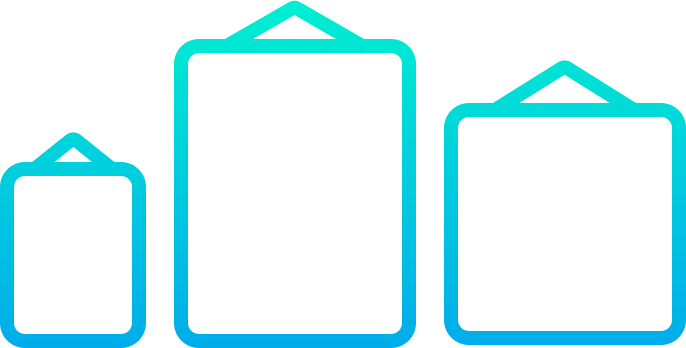

<div align="center">
  
    <h1 style="border-bottom: none">
			Frames      
    </h1>
  <div>
      <a href="https://swiftpackageindex.com/ptrkstr/Frames"></a>
      <a href="https://swiftpackageindex.com/ptrkstr/Frames"></a>
      <br>
      <a href="https://github.com/apple/swift-package-manager" alt="Frames on Swift Package Manager"></a>
      <a href="https://github.com/ptrkstr/Frames/actions/workflows/swift.yml"></a>
      <a href="https://codecov.io/gh/ptrkstr/Frames"></a>
  </div>
  <p>
    A Swift package that exposes fastlane's frameit frame images.
  </p>
</div>

## Usage

There are two ways of accessing an image. Each returns a `Frame` which is a typealias for `UIImage`/`NSImage`.

### Properties

```swift
let frames = Frames()
frames.appleMacbookPro13Silver
frames.appleMacbookPro13SpaceGray
frames.appleMacbookPro15Silver
// etc
```

### Method

Look inside the `/latest` folder for names. Error thrown if image for name doesn't exist

```swift
let frames = Frames()
do {
    try frame(named: "Apple Macbook Pro 13 Silver.png")
} catch {
	  
}
```

## Installation

Add the following to your project/package.swift:

```
https://github.com/ptrkstr/Frames
```

## Where do the images come from?

https://github.com/fastlane/frameit-frames

## How will this stay up to date with new images?

This repository forks [frameit-frames](https://github.com/fastlane/frameit-frames). When that repository is updated, `Fetch upstream` will be called to merge updates.

## Can I request you add X image?

This repository doesn't manage images directly. Please see where the [forked repository](https://github.com/fastlane/fastlane/tree/master/frameit/frames_generator) sources its images.

## How do the properties get generated?

Run the unit test, copy the console output and paste into `Frames+Properties.swift`. A future improvement would be to have a function automatically paste the properties.
